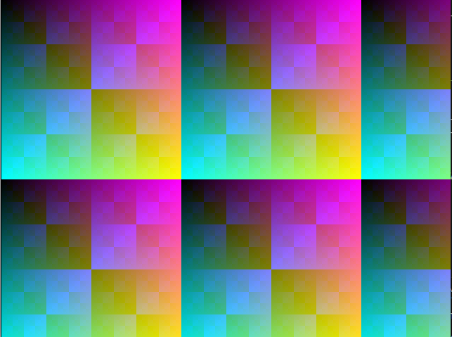

# Simulação VGA com Verilator e SDL (Ambiente Linux)

Este README explica como preparar o ambiente e executar a simulação do seu módulo VGA em Verilog usando Verilator e SDL2, exibindo um gradiente colorido no vídeo.

---

### Requisitos

- **Verilator** (versão recente)

- **GCC** ou outro compilador C++

- **SDL2** e seus arquivos de desenvolvimento (`libsdl2-dev` no Linux)

- **Make** (para usar o Makefile)

- Seu código Verilog (`top.v` e `vgaController.v`)

---

### Estrutura do projeto

~~~
/project_root
  ├── top.v              # seu top module com gradiente
  ├── vgaController.v    # seu controlador VGA (timings etc)
  ├── sim.cpp            # programa C++ que usa SDL para desenhar pixels
  ├── Makefile           # script para compilar e simular
  └── README.md          # este arquivo
~~~

---

### Passo 1 — Instalar dependências

No Ubuntu/Debian, execute:

~~~
sudo apt update
sudo apt install verilator libsdl2-dev g++ make
~~~

---

### Passo 2 — Código Verilog

Use `top.v` com o gradiente (conforme exemplo abaixo) ou o `top_whiteBG`:

~~~
// top.v (resumo)
module top(
    input wire clk,
    input wire sim_rst,
    output wire [9:0] sdl_sx,
    output wire [9:0] sdl_sy,
    output wire sdl_de,
    output reg [7:0] sdl_r,
    output reg [7:0] sdl_g,
    output reg [7:0] sdl_b
);
// ... (divisor clock, instanciamento vgaController, saída gradiente)
endmodule
~~~

E seu `vgaController.v` (timings VGA 640x480 @60Hz).

---

### Passo 3 — Código C++ de simulação (sim.cpp)

Este arquivo controla a simulação e exibe a imagem via SDL.

Você pode adaptar o exemplo do tutorial [Verilog Simulation with Verilator and SDL](https://projectf.io/posts/verilog-sim-verilator-sdl/), que inclui:

- Instanciação do Verilator do seu top

- Loop de simulação que avança o clock

- Atualização do framebuffer SDL com base nos sinais sdl_sx, sdl_sy, sdl_de e cores

---

### Passo 4 — Makefile para compilar e simular

Exemplo simplificado de Makefile para seu projeto:

~~~
# Makefile para simular seu projeto VGA no Verilator com SDL

# Flags do Verilator
VFLAGS = -Wall -O3 --x-assign fast --x-initial fast --noassert

# SDL2 flags
SDL_CFLAGS = $(shell sdl2-config --cflags)
SDL_LDFLAGS = $(shell sdl2-config --libs)

# Arquivos Verilog do seu projeto
VERILOG_SOURCES = top.v vgaController.v 

# Nome do executável
EXEC = vga_sim

# Alvo principal
all: $(EXEC)

# Como gerar o executável
$(EXEC):
	verilator $(VFLAGS) -cc $(VERILOG_SOURCES) --exe sim.cpp -o $(EXEC) \
		-CFLAGS "$(SDL_CFLAGS)" -LDFLAGS "$(SDL_LDFLAGS)" --build

# Limpar a simulação
clean:
	rm -rf obj_dir $(EXEC)

.PHONY: all clean
~~~

---

### Passo 5 — Compilar e executar

Na pasta do projeto, execute:

~~~
make
./obj_dir/vga_sim
~~~

- A janela SDL deve abrir e mostrar o gradiente colorido na tela simulada.

- Pressione `Q` para sair.

---

### Dicas

- Se a janela abrir preta, cheque sinais `de` e as cores no seu código Verilog.

- Ajuste o divisor de clock caso o sinal `clk` não seja 50 MHz.

- Adicione prints ou waveform (`--trace`) para depurar no Verilator.

- Use o `top.v` com as portas `sdl_sx`, `sdl_sy`, `sdl_de`, `sdl_r`, `sdl_g`, `sdl_b` para ligar ao SDL em `sim.cpp`.

---

### Referências

- Tutorial original: [projectf.io/posts/verilog-sim-verilator-sdl](https://projectf.io/posts/verilog-sim-verilator-sdl/)

- Documentação Verilator: https://verilator.org

- SDL2: https://www.libsdl.org/